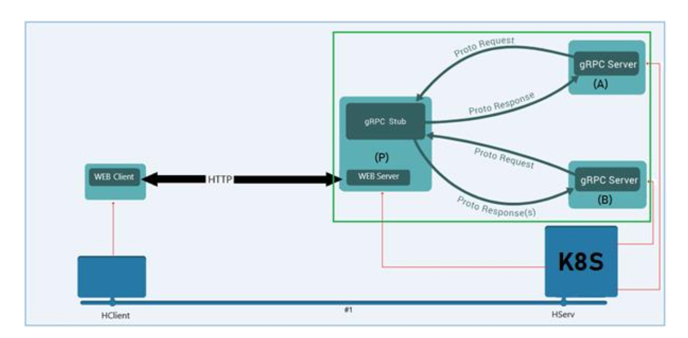

# Distributed Video Store

Projeto de locadora e loja virtual de filmes utilizando conceitos de computação distribuida, gRPC e Kubernetes. Desenvolvido para a disciplina **PSPD - Programação para Sistemas Paralelos e Distribuídos (Turma 02)** – **UnB/FCTE – Engenharia de Software** 

- **Professor:** Prof. Fernando W. Cruz  
- **Aluno:** Eric Chagas de Oliveira  
- **Matrícula:** 180119508
- **Link do vídeo de apresentação**: https://youtu.be/Evx_FKEMHno

## Descrição do Projeto

O **Distributed Video Store** é uma aplicação simples de aluguel e compra de filmes online. 

O sistema será distribuído e baseado em **microserviços**, será utilizado o **framework gRPC** para comunicação entre serviços e **Kubernetes (Minikube)** para orquestração e deploy em contêineres.

### Objetivos

1. Estudo do gRPC, seus componentes e os quatro tipos de comunicação.
2. Implementação da aplicação cliente/servidor Distributed Video Store
3. Implementação de uma versão alternativa baseada em Rest-API para comparação de desempenho com a versão gRPC.
4. Simulação de um ambiente Cloud Native com k8s localmente usando o Minikube.

## Estrutura da Aplicação

| Módulo | Função | Tecnologia | Linguagem |
| :--- | :--- | :--- | :--- |
| **frontend** | Implementação do front-end que realiza chamadas HTTP para o API Gateway | VueJs | Typescript |
| **API Gateway** | Recebe requisições REST, traduz para gRPC e agrega respostas. É a implementação do serviço **P** | FastAPI | Python |
| **Catalogue Service (Microserviço 1)** | É a implementação do microsserviço **A**, que gerencia catálogo de vídeos | Go gRPC server | Go lang |
| **Rent Service (Microserviço 2)** | É a implementação do microsserviço **B**, que  gerencia informações de clientes e pedidos | Go gRPC server | Go lang |


###### Figura 01 - Arquitetura Sugerida


## Stack tecnológica do projeto

| Tecnologia | Função |
| :--- | :--- | 
| **gRPC** | Comunicação entre microserviços |
| **Protocol Buffers (Protobuf)** | Serialização de dados |
| **HTTP/2** | Transporte de dados binários |
| **Docker** | Contêineres para cada módulo |
| **Minikube (K8s)** | Orquestração e deploy local |
| **Go lang** | Implementação do microserviço A |
|**Fast API**| Implementação do API gateway |
| **Go lang** | Implementação do microserviço B |
| **VueJs** | Implementação dos front-end |


## Funcionalidades Principais

- Comunicação **Unary**, **Server Streaming**, **Client Streaming** e **Bidirectional Streaming** com gRPC  
- API Gateway REST conectando múltiplos microserviços gRPC  
- Deploy automatizado com Minikube  
- Testes de performance comparando **gRPC vs REST/JSON**

### Escopo do trabalho e observações

Em geral, é comum utilizar ambientes com múltiplos repositórios para aplicações baseadas em microsserviços, especialmente quando o time de desenvolvimento é dividido em sub-times que podem trabalhar em serviços diferentes paralelamente. No entanto, para o escopo desse trabalho, que é uma simulação desenvolvida apenas por uma pessoa, será adotada uma estratégia de monorepo, ou seja, o projeto será organizado em um único repositório, e o deploy de cada componente da arquitetura no kubernetes será feito de maneira distribuída através dos manifestos de configuração.

## Como Executar 

### Pré-requisitos

- **Python 3.11+** e **pip**
- **Virtualenv** (`python3 -m pip install virtualenv`)
- **Go 1.22+**
- **Docker**
- **Minikube** e **kubectl**
- **protoc** (Protocol Buffers Compiler)

### Para subir o ambiente: Executar o script `setup.sh` para subir a infra completa e todos os serviços

```bash
sudo chmod +x ./setup.sh
./setup.sh
```

### Para destruir o ambiente: Executar o script `destroy.sh` para derrubar a infra e os serviços

```bash
sudo chmod +x ./destroy.sh
./destroy.sh
```

