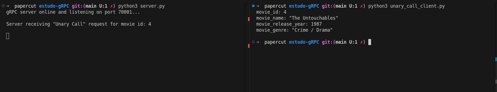

# Relatório de Atividade Extraclasse - Desenvolvimento de Aplicações Distribuídas com gRPC e Kubernetes

| Item | Descrição |
| :--- | :--- |
| **Curso** | UnB/FCTE – Engenharia de Software |
| **Semestre** | 2025/2 |
| **Disciplina** | PSPD - Programação para Sistemas Paralelos e Distribuídos - Turma 02 |
| **Professor** | Prof. Fernando W. Cruz |
| **Aluno** | Eric Chagas de Oliveira |
| **Matrícula** | 180119508 |

---

## 1. Introdução

Esse relatório descreve o desenvolvimento de um sistema distribuído de uma loja e locadora de filmes virtual. A aplicação “Distributed Video Store” desenvolvida para o trabalho, é baseada em microserviços e foi utilizado o framework gRPC, com posterior empacotamento em contêineres e deploy em um ambiente de Kubernetes simulado localmente com o Minikube.

### Objetivos
1. Estudo do gRPC, seus componentes e os quatro tipos de comunicação.
2. Implementação da aplicação cliente/servidor Distributed Video Store
3. Implementação de uma versão alternativa baseada em Rest-API para comparação de desempenho com a versão gRPC.
4. Simulação de um ambiente Cloud Native com k8s localmente usando o Minikube.

### Escopo do trabalho e observações

Em geral, é comum utilizar ambientes com múltiplos repositórios para aplicações baseadas em microsserviços, especialmente quando o time de desenvolvimento é dividido em sub-times que podem trabalhar em serviços diferentes paralelamente. 

No entanto, para o escopo desse trabalho, que é uma simulação desenvolvida apenas por uma pessoa, será adotada uma estratégia de monorepo, ou seja, o projeto será organizado em um único repositório, e o deploy de cada componente da arquitetura no kubernetes será feito de maneira distribuída através dos manifestos de configuração.

## 2. O Framework gRPC e Tipos de Comunicação

### 2.1. Conceitos usados pelo gRPC

#### Protocol Buffers (Protobuf) 
  O Protobuf é usado pelo gRPC para a serialização dos dados enviados pela rede e como linguagem de definição de interface (IDL). Ele permite definir as mensagens e serviços em um arquivo `.proto`, a partir do qual são gerados os **stubs** para as diferentes linguagens de programação.

#### HTTP/2
  O gRPC também se baseia no protocolo HTTP/2, que oferece **multiplexação de streams**, **compressão de cabeçalhos** e **server push**, possibilitando comunicações simultâneas, menor latência e uso mais eficiente dos recursos de rede.

### 2.2. Estudo e simulação dos tipos de comunicação

O gRPC possui 4 tipos de comunicação, que são bem descritos na página [Core concepts, architecture and lifecycle](https://grpc.io/docs/what-is-grpc/core-concepts/) da documentação oficial.

Para esse trabalho foi construida uma pequena aplicações cliente-servidor, com um servidor e quarto clientes implementando cada um dos tipos de chamada mostrados na **Tabela 01**. 

###### Tabela 01 - Tipos de chamada gRPC. Fonte: Autoria própria com base na documentação oficial do gRPC

| Tipo de Comunicação | Funcionamento | Arquivo Protobuf e Código de Teste | Conclusão e Cenários de Uso Recomendados |
| :--- | :--- | :--- | :--- |
| **Unary Call** | Cliente envia uma requisição e recebe uma resposta única. | [`unary-call/movie_info.proto`](#TODO:Adicionar_link_direto_arquivo_github) | Ideal para operações simples de consulta ou cadastro. |
| **Server-Streaming Call** | Cliente envia uma requisição e recebe múltiplas respostas em *stream*. | [`server-streaming/movie_info.proto`](#TODO:Adicionar_link_direto_arquivo_github) | Útil para relatórios, logs contínuos ou notificações. |
| **Client-Streaming Call** | Cliente envia múltiplas requisições e recebe uma resposta única consolidada. | [`client-streaming/movie_info.proto`](#TODO:Adicionar_link_direto_arquivo_github) | Adequado para upload de arquivos ou envio de lotes de dados. |
| **Bidirectional Streaming Call** | Cliente e servidor trocam múltiplas mensagens simultaneamente. | [`bidirectional-streaming/movie_info.proto`](#TODO:Adicionar_link_direto_arquivo_github) | Perfeito para chats em tempo real ou monitoramento contínuo. |

Também linkado na **Tabela 01** está o endereço no github onde foram armazenados os arquivos de da demonstração. Os arquivos são os seguintes:

- `movie_info.proto`: Arquivo para definição de interface do serviço gRPC
- `estudo-gRPC/server.py`: Arquivo do servidor com 4 métodos, cada um com a lógica de resposta implementando um dos tipos de chamada do gRPC
- `estudo-gRPC/client_stream_client.py`: Arquivo de cliente que realiza chamadas **client stream**, enviando um id de filme por vez e processa a resposta única do servidor após ter terminado de enviar todos os IDs
- `estudo-gRPC/server_stream_client.py`: Arquivo de cliente que realiza uma única chamada para o servidor, passando uma lista de ids de filmes separados por vírgula, e processa acada id recebido como resposta no **server stream** à medida que recebe, também um por vez
- `estudo-gRPC/unary_call_client.py`: Arquivo de cliente que realiza uma única chamada para o servidor com um id de filme, e recebe uma única resposta com os dados do filme
- `estudo-gRPC/bidirectional_stream_client.py`: Arquivo de cliente que realiza chamadas **client stream**, enviando um id de filme por vez e processa a resposta **server stream** à medida que recebe, também um por vez

Os arquivos `movie_info.proto` e `server.py` são comuns à todos os tipos de chamadas, por tanto estão detalhados aqui. Os clientes serão detalhados na seção dedicada a cada teste.

**movie_info.proto**:

Arquivo disponibilizado em [movie_info.proto](https://github.com/Eric-chagas/distributed-video-store/blob/main/estudo-gRPC/server.py).

No .proto são definidos os métodos de cada um dos tipos de chamada, e o formato das mensagens que podem ser trocadas entre cliente e servidor.

```
// gRPC service
service MovieInfo {
    // Unary Call: 1 client request and 1 server response
    rpc GetMovieInfo (MovieRequest) returns (MovieReply);

    // Server Streaming: 1 Client request with many ids comma separated and many server responses
    rpc GetMoviesServerStream (MovieListRequest) returns (stream MovieReply);

    // Client Streaming: Many Client request with 1 id each, and 1 server response with a list
    rpc GetMoviesClientStream (stream MovieRequest) returns (MovieListReply);

    // Bidirectional Streaming: Many Client request with 1 id each, and many server responses with 1 movie each
    rpc GetMoviesBidirectionalStream (stream MovieRequest) returns (stream MovieReply);
}

// Message client request with 1 movie_id
message MovieRequest {
    int32 movie_id = 1;
}

// Message Server response with 1 movie
message MovieReply {
    int32 movie_id = 1;
    string movie_name = 2;
    int32 movie_release_year = 3;
    string movie_genre = 4;
}

// Message client request with a list of movie_ids
message MovieListRequest {
    repeated int32 movie_ids = 1;
}

// Message Server response with a list of movies
message MovieListReply {
    repeated MovieReply movies = 1;
}
```

**server.py**:

Arquivo disponibilizado na íntegra em [server.py](https://github.com/Eric-chagas/distributed-video-store/blob/main/estudo-gRPC/server.py).

O servidor implementa os métodos definidos no .proto e ao ser executado "aguarda" chamadas na porta definida (70001).

```
...
    
    # Implementing GetMovieInfo defined in proto file
    def GetMovieInfo(self, request, context):
        
        print(f"\nServer receiving \"Unary Call\" request for movie id: {request.movie_id}\n")
        
        # Get movie from list
        movie_response = next((movie for movie in self.movies if movie["movie_id"] == request.movie_id))
        
        return movie_info_pb2.MovieReply(
            movie_id=movie_response["movie_id"],
            movie_name=movie_response["movie_name"],
            movie_release_year=movie_response["movie_release_year"],
            movie_genre=movie_response["movie_genre"]
        )
    
    # Server Streaming method for returning movies to the client, one at a time
    def GetMoviesServerStream(self, request, context):
        
        print(f"\nServer receiving \"Server Streaming\" request for movie IDs: {request.movie_ids}\n")
        
        for movie_id in request.movie_ids:
            movie = next((m for m in self.movies if m["movie_id"] == movie_id), None)
            if movie:
                yield movie_info_pb2.MovieReply(**movie)
            else:
                print(f"Movie with ID {movie_id} not found")
                
    # Client streaming method for returning a list of movies at once, for several ids streamed by client
    def GetMoviesClientStream(self, request_iterator, context):
        
        print(f"\nServer receiving \"Client stream\" request...\n")

        movie_list = []
        for request in request_iterator:
            movie = next((m for m in self.movies if m["movie_id"] == request.movie_id), None)
            if movie:
                movie_list.append(movie_info_pb2.MovieReply(**movie))
        return movie_info_pb2.MovieListReply(movies=movie_list)

    # Bidirectional streaming method for returning one film at a time by each id streamed by client
    def GetMoviesBidirectionalStream(self, request_iterator, context):
        
        print(f"\nServer receiving \"Bidirectional stream\" request...\n")
        
        for request in request_iterator:
            movie = next((m for m in self.movies if m["movie_id"] == request.movie_id), None)
            if movie:
                yield movie_info_pb2.MovieReply(**movie)
    
def serve():
    server = grpc.server(futures.ThreadPoolExecutor(max_workers=8)) # Defining number of threads to process requests paralel
    movie_info_pb2_grpc.add_MovieInfoServicer_to_server(MovieInfoServicer(), server) 
    server.add_insecure_port('[::]:70001') # Defining server port as 70001
    server.start()
    print("gRPC server online and listening on port 70001...")
    server.wait_for_termination()

if __name__ == '__main__':
    serve()

```

### 2.3 Aplicações de exemplo para os tipos de chamada

Para as demonstrações dos tipo de chamada, foram desenvolvidos quatro programas simples, em python, e que implementam o gRPC usando as bibliotecas `grpcio` e `grpcio-tools`. 

O contexto é o mesmo para as quatro: O servidor contém uma lista de filmes com as seguintes informações para cada um:
1. `movie_id`: "chave primária" do filme (int32) 
2. `movie_name`: nome do filme (string)
3. `movie_release_year`: ano de lançamento do filme (int32)
4. `movie_genre`: Gênero do filme (string)

#### 2.3.1 Método de reprodução dos testes

Para reproduzir o experimento, basta seguir os passos abaixo:

> Requisitos:
> 
> 1. Estar em um ambiente linux
> 2. Possuir o Python3 instalado. Versão usada nesse trabalho: 3.12.3  

1. Clonar o repositório, acessa-lo

```bash
git clone git@github.com:Eric-chagas/distributed-video-store.git
cd distributed-video-store
```
2. Instalar as dependências do python

```bash
# Criar ambiente virtual python para instalar as dependencias
python3 -m venv .venv
source .venv/bin/activate

pip install -r requirements.txt
```

3. Acessar o diretório do teste e gerar os arquivos do gRPC com o protoc

```bash
cd estudo-gRPC/
python3 -m grpc_tools.protoc -I. --python_out=. --grpc_python_out=. ./movie_info.proto
```
Serão criados os arquivos `movie_info_pb2_grpc.py` e `movie_info_pb2.py` 

4. Agora execute o servidor

```bash
python3 server.py 
```
O output deve ser "gRPC server online and listening on port 70001...". Agora é necessário abrir um novo terminal para executar as chamadas dos clientes.

1. Em um novo terminal, para executar os clientes:

```bash
# É necessário iniciar o virtualenv do python no novo terminal também. Na raiz do repositório:
source .venv/bin/activate

# Em seguida, basta executar os clientes

python3 unary_call_client.py                # unary_call_client
python3 server_stream_client.py             # server_stream_client
python3 client_stream_client.py             # client_stream_client
python3 bidirectional_stream_client.py      # bidirectional_stream_client

```

Cada um dos clientes terá o comportamento melhor detalhado nas seções dedicadas abaixo.

#### 2.3.2 Unary Call

Para a demonstração do tipo de chamada unary call, o cliente deve chamar o stub de `GetMovieInfo(movie_id)` passando como argumento o `movie_id` do filme desejado. Por se tratar de **unary call** o cliente envia apenas um id, e aguarda o retorno do servidor, que consiste em um único filme.

O arquivo `unary_call_client.py` implementa a chamada ao stub de unary call do servidor.

```python
def run():
    with grpc.insecure_channel('localhost:70001') as channel:
        stub = movie_info_pb2_grpc.MovieInfoStub(channel) # using created channel to server
        response = stub.GetMovieInfo(movie_info_pb2.MovieRequest(movie_id=4)) # sending request for movie with id 4 and wating response
        print(response) # Printing single movie response

```

Na Figura 01, está ilustrado o resultado da execução desse cliente.

###### Figura 01 - Execução do exemplo de unary call. Fonte: Autoria própria



#### 2.3.3 Server streaming

Para a demonstração do tipo de chamada Server Streaming, o cliente deve chamar o stub de `GetMoviesServerStream(movie_id_list)` passando como argumento o a lista de movie_ids separados por vírgula dos filmes desejados. Por se tratar de **server stream call** o cliente envia apenas uma lista de ids de uma vez, e aguarda o retorno do servidor, que consiste nos vários filmes requisitados, um por vez.

O arquivo `server_stream_client.py` implementa a chamada ao stub de service streaming do servidor.

```python
def run():
    with grpc.insecure_channel('localhost:70001') as channel:
        stub = movie_info_pb2_grpc.MovieInfoStub(channel) # using created channel to server
        request = movie_info_pb2.MovieListRequest(movie_ids=[1, 3, 5, 9])
        
        # Calling server streaming sending list of ids
        responses = stub.GetMoviesServerStream(request)
        
        for movie in responses:
            print("Movie ID: ", movie.movie_id)
            print("Movie name: ", movie.movie_name)
            print("Movie year: ", movie.movie_release_year)
            print("Movie genre: ", movie.movie_genre)
            print()

```

Na Figura 02, está ilustrado o resultado da execução desse cliente.

###### Figura 02 - Execução do exemplo de server stream call. Fonte: Autoria própria


#### 2.3.4 Client streaming

Para a demonstração do tipo de chamada Client Streaming, o cliente deve chamar o stub de `GetMoviesClientStream(movie_id)` passando como argumento um movie_id por vez no formato de stream do cliente. Por se tratar de **client stream call** o cliente envia um id por vez, o servidor aguarda receber todos, e enfim processa e responde com a lista de filmes pedidos, de uma só vez.

O arquivo `client_stream_client.py` implementa a chamada ao stub de client streaming do servidor.

```python
def generate_movie_requests():
    for movie_id in [1, 4, 6, 9]:
        print(f"Client: Now sending movie_id {movie_id}")
        yield movie_info_pb2.MovieRequest(movie_id=movie_id)
        time.sleep(0.5) 

def run():
    with grpc.insecure_channel('localhost:70001') as channel:
        stub = movie_info_pb2_grpc.MovieInfoStub(channel) # using created channel to server        
        # Calling server streaming sending list of ids
        response = stub.GetMoviesClientStream(generate_movie_requests())
                
        for movie in response.movies:
            print("Movie ID: ", movie.movie_id)
            print("Movie name: ", movie.movie_name)
            print("Movie year: ", movie.movie_release_year)
            print("Movie genre: ", movie.movie_genre)
            print()

```

Na Figura 03, está ilustrado o resultado da execução desse cliente.

###### Figura 03 - Execução do exemplo de client stream call. Fonte: Autoria própria


#### 2.3.5 Bidirectional streaming

Para a demonstração do tipo de chamada Bidirectional Streaming, o cliente deve chamar o stub de `GetMoviesBidirectionalStream(movie_id)` passando como argumento um movie_id por vez no formato de stream do cliente. Por se tratar de **bidirectional stream call** o cliente envia um id por vez, e o servidor responde à medida que recebe, respondendo também um filme por vez ao cliente, no formato de server stream.

O arquivo `bidirectional_stream_client.py` implementa a chamada ao stub de bidirectional streaming do servidor.

```python
def generate_movie_requests():
    for movie_id in [1, 4, 6, 9]:
        print(f"Client: Now sending movie_id {movie_id}")
        yield movie_info_pb2.MovieRequest(movie_id=movie_id)
        time.sleep(1) 

def run():
    with grpc.insecure_channel('localhost:70001') as channel:
        stub = movie_info_pb2_grpc.MovieInfoStub(channel) # using created channel to server        
        
        # Calling server streaming sending list of ids
        response = stub.GetMoviesBidirectionalStream(generate_movie_requests())
                
        for movie in response:
            print("Movie ID: ", movie.movie_id)
            print("Movie name: ", movie.movie_name)
            print("Movie year: ", movie.movie_release_year)
            print("Movie genre: ", movie.movie_genre)
            print()
```

Na Figura 04, está ilustrado o resultado da execução desse cliente.

###### Figura 04 - Execução do exemplo de client stream call. Fonte: Autoria própria


#### 2.3.6 Discussão do estudo

Ao implementar os métodos acima, percebo que assim como em outros temas da computação como arquitetura de microsserviços e monolito, polirepo e monorepo, orientado a eventos e orientado a chamadas, entre outros assuntos, não existe bala de prata com relação a qual tipo de chamada gRPC utilizar. 

Fica claro que cada situação pode demandar um tipo diferente de chamada, minha percepção após esse experimento é:

1. **Unary calls**: Pode ser melhor utilizada em chamadas nas quais o processamento paralelo de chamadas não é algo crucial, para extrações pontuais ou consultas mais simples
2. **Server stream**: Acredito que possa ser bem empregado em situações onde o cliente está ativamente aguardando por resposta do servidor por exemplo, mas os dados recebidos podem ser entregues em partes. No caso da locadora por exemplo, não é um problema mostrar os filmes à medida que o cliente às recebe na tela, e manter um "loading" para o que ainda não foi carregado. O mesmo não pode ser dito de um sistema bancário por exemplo, em que se o cliente recebe um nome, ou valor monetário "quebrado" isso pode ter consequências graves.
3. **Client stream**: Esse aparenta se adequar melhor a situações opostas à que citei no server stream, por exemplo, quando não se tem problema em aguardar pela resposta do servidor do lado do cliente, e é importante receber os dados completos, de uma vez só para que a consistência das regras de negócio não sejam prejudicadas. Acredito que também se comporte bem quando a conexão do lado do cliente é lenta, os dados são enviados em partes e o servidor responde após receber todos.
4. **Bidirectional stream**: O bidirectional stream, pode se comportar bem quando empregado em comunicações como chats online por exemplo, onde se requer uma sincronia maior mas não é possível prever quantos pacotes serão enviados em um período de tempo.

## 3. Construção da Aplicação Cliente/Servidor com gRPC

### 3.1. Detalhes da Aplicação Distributed Video Store

  O sistema simula uma loja de vídeos distribuída, permitindo consultar informações sobre filmes, combinando dados provenientes de dois microserviços independentes:  
  - **Serviço A (Catálogo):** fornece metadados de filmes (título, gênero, duração, ano).  
  - **Serviço B (Estoque):** retorna informações de disponibilidade e preço de aluguel.  
  O **Gateway (P)** atua como ponto de entrada REST, recebendo requisições HTTP do cliente web, convertendo-as em chamadas gRPC para os microserviços e consolidando as respostas em um único JSON.
  
- **Linguagens Utilizadas:**
  - **Módulo P (Gateway/API):** Python (FastAPI + gRPC client)  
  - **Módulo A (Catálogo):** Go (gRPC server)  
  - **Módulo B (Estoque):** Go (gRPC server)  
  - **Frontend:** VueJs consumindo a API REST do gateway  

### 3.2. Estrutura dos Módulos Backend (P, A e B)

- **Módulo P (API Gateway / gRPC Stub):**  
  Recebe requisições HTTP (`GET /api/movies/:id` e `GET /api/rent/check_availability/:id`), chama os serviços A e B via gRPC, consolida os dados (metadados + disponibilidade/preço) e retorna a resposta em JSON.  
  - **Framework:** FastAPI  
  - **Exemplos de rota:**
    - `http://localhost:8000/api/movies/1`
    - `http://localhost:8000/api/rent/check-availability/1`  

- **Módulo A (gRPC Server - Catálogo):**  
  Implementado em Go. Retorna informações estáticas de filmes (título, gênero, ano de lançamento, duração).

- **Módulo B (gRPC Server - Estoque):**  
  Também implementado em Go. Retorna disponibilidade (em estoque ou não), preço de aluguel e possíveis promoções.


